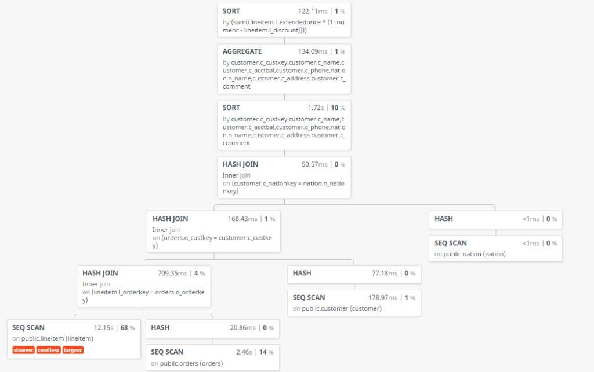

---
papersize: letter
geometry: margin=1in
documentclass: article
fontsize: 12pt
toc: true
toc-depth: 2
...

\newpage

# Estadísticas sobre la base de datos FBV

El primer paso pasa poder optimizar las consultas dadas es conocer el volumen
total de la base de datos, el volumen de cada tabla individual, el tamaño
promedio de cada fila, y las estadísticas apropiadas para cada consulta.

## Estadísticas generales de la base de datos

En esta subsección se describen las estadísticas relacionadas con la base de
datos en su totalidad, independientemente de las consultas que se vayan a
optimizar.

### Volumen total de los datos

Para determinar el volumen total de tuplas existentes en la base de datos se
realizó la siguiente consulta:

~~~sql
    select sum(n_live_tup)
    from pg_stat_user_tables
    where schemaname='original';
~~~~

La consulta arrojó un valor de 8660591 tuplas.

### Volumen total de cada tabla

Para calcular el volumen total de cada tabla utilizamos la siguiente consulta:

~~~sql
    select
      c.relname,
      n_live_tup,
      relpages,
      floor(n_live_tup/relpages::float) as tuples_per_page
    from 
      pg_stat_user_tables b, 
      pg_class c
    where relnamespace = (select oid from pg_namespace where nspname='original')
      and schemaname = 'original'
      and b.relname= c.relname;
~~~

De esta consulta se obtuvieron los resultados de la tabla 1.

| Tabla       | Tuplas  | Páginas | Tuplas por pagina |
|-------------|--------:|--------:|------------------:|
| `part`      | 200000  | 3715    | 53                |
| `supplier`  | 10000   | 213     | 46                |
| `partusupp` | 800000  | 17451   | 45                |
| `lineitem`  | 6001181 | 98544   | 60                |
| `region`    | 5       | 1       | 5                 |
| `nation`    | 25      | 1       | 25                |
| `customer`  | 150000  | 3566    | 42                |
| `orders`    | 1500000 | 25196   | 59                |

: Tuplas, páginas y tuplas por página de las tablas de FBV

\begin{center}
Figura 1: Cantidad de tuplas en cada tabla

\begin{tikzpicture}
\begin{axis}[
height=6cm,
width=12cm,  
  ymin=0,
  axis y line*=left,
  axis x line*=bottom,
  xticklabels={
    \texttt{part},
    \texttt{supplier},
    \texttt{partusupp},
    \texttt{lineitem}, 
    \texttt{region},
    \texttt{nation},
    \texttt{customer},
    \texttt{orders}},
  xtick={1,...,8},
  x tick label style={rotate=50,anchor=east}]
\addplot[ybar,fill=gray]
coordinates {
(8, 1500000)
(7, 150000)
(6, 25)
(5, 5)
(4, 6001181)
(3, 800000)
(2, 10000)
(1, 200000)
};
\end{axis}
\end{tikzpicture}
\end{center}

En la figura 1 podemos observar que la tabla de `lineitem` ocupa la mayor parte
de los datos almacenados (aproximadamente un 69% del total de tuplas).
Cualquier consulta que requiera acceder a una buena parte de los datos
almacenados en esta tabla exigirá mucha atención al momento de ser optimizada.

Para las tablas `nation` y `region`, dado que caben en una sola página, se puede
concluir que no necesitan optimización alguna pues un acceso directo es siempre
la mejor opción para recuperar sus registros.

## Análisis de cada tabla

En el análisis de cada tabla tomarán en cuenta los siguientes aspectos:

- Tamaño promedio de la tupla

- Para cada atributo, su tamaño promedio, cantidad de elementos distintos y
  factor de reducción.

- Cualquier otra estadística que resulte últil para la optimización de alguna de
  las consultas propuestas.


Para el cálculo del tamaño promedio de cada tupla, en todas las tablas, se
realizó la siguiente consulta:

```sql
    select
      tablename,
      sum(avg_width) as tam_promedio_tuplas
    from
      pg_stats
    where
      tablename in (
        select
          relname
        from pg_stat_user_tables)
    group by
      tablename;
```

De la cual se obtuvieron los siguientes resultados

| Tabla       | Tamaño promedio de tupla |
|-------------|-------------------------:|
| `part`      | 114                      |
| `supplier`  | 137                      |
| `partusupp` | 144                      |
| `lineitem`  | 98                       |
| `region`    | 78                       |
| `nation`    | 91                       |
| `customer`  | 158                      |
| `orders`    | 100                      |

: Tamaño promedio de cada tupla

En el análisis de cada tabla, se realizó una consulta diseñada para extraer la
siguiente información acerca de las tablas:

- El tamaño medio de cada atributo

- El número de valores distintos que tiene la columna. Si el valor es -1, es un
  valor único

- La correlación que existe entre el orden lógico y el orden físico ( mientras
  más cercano a 1 o -1 mejor a la hora de que el manejador haga index scan)

- La frecuencia más alta hallada. Esta nos permite tener una cota superior para
  un determinado valor

- El factor reductor. Para conocer la selectividad de la columna.

La consulta es la siguiente:

```sql
    prepare stats_table as
    select  
      attname, 
      avg_width,
      ( case 
          when n_distinct < 0  and n_distinct <> -1
            then -n_distinct * t.reltuples
            else n_distinct
          end) as ndistinct, 
      correlation,
      most_common_freqs[1] as upper_bound, 
      ( case 
          when n_distinct < 0
            then -1 / (n_distinct * t.reltuples)
            else 1 / n_distinct
          end) as FR
    from 
      pg_stats,
      ( select
          relname,
          reltuples 
        from
          pg_class 
        where relnamespace = ( 
          select 
            oid
          from
            pg_namespace
          where
            nspname='original')
        ) t
    where t.relname = tablename
      and tablename = $1
      and schemaname = 'original'
    order by
      fr;
```

### Análisis de `lineitem`

Al ejecutar la consulta sobre lineitem se obtuvieron los resultados mostrados en
la Tabla 3. De la tabla se puede decir que las columnas con peor selectividad
son `l_linestatus`, `l_returnflag` y `l_shipsintruct`. Por otro lado, los
atributos con mayor selectividad tenemos `l_comment`, `l_orderkey` y
`l_extendedprice`.

| Atributo          | Tam. pr. | # vals. dist. | Correlación  | Cota sup.   | Selectividad  |
|-------------------|----------|---------------|--------------|-------------|---------------|
| `l_orderkey`      | 4        | 1206300       | 1            | 0.000016667 | 0.000000829   |
| `l_partkey`       | 4        | 197029        | 0.00235099   | 0.00003     | 5.07539E-06   |
| `l_suppkey`       | 4        | 10000         | -0.000106049 | 0.000173333 | 0.0001        |
| `l_linenumber`    | 4        | 7             | 0.176068     | 0.250317    | 0.14285714    |
| `l_quantity`      | 5        | 50            | 0.0195651    | 0.0205067   | 0.02          |
| `l_extendedprice` | 8        | 767024        | 0.000341259  | 2.33333E-05 | 1.3037401E-06 |
| `l_discount`      | 4        | 11            | 0.0868008    | 0.0922367   | 0.09090909    |
| `l_tax`           | 4        | 9             | 0.109181     | 0.11199     | 0.11111111    |
| `l_returnflag`    | 2        | 3             | 0.377041     | 0.506517    | 0.33333333    |
| `l_linestatus`    | 2        | 2             | 0.499747     | 0.500087    | 0.5           |
| `l_shipdate`      | 4        | 2525          | -0.00126623  | 0.000536667 | 0.00039603    |
| `l_comitdate`     | 4        | 2465          | -0.00119272  | 0.000536667 | 0.00040567    |
| `l_receipdate`    | 4        | 2543          | -0.00128363  | 0.000553333 | 0.00039323    |
| `l_shipinstruct`  | 13       | 4             | 0.250591     | 0.250767    | 0.25          |
| `l_shipmode`      | 5        | 7             | 0.145059     | 0.143523    | 0.14285714    |
| `l_comment`       | 27       | 1763690       | 0.000151724  | 0.000193333 | 0.000000567   |

: Estadísticas para la relación `lineitem`

### Análisis de `orders`

Al ejecutar la consulta sobre orders, se obtuvieron los resultados mostrados en
la Tabla 4. 

| Atributo          | Tam. pr. | # vals. Dist. | Correlación | Cota sup.   | Selectividad     |
|-------------------|----------|---------------|-------------|-------------|------------------|
| `o_orderkey`      | 4        | -1            | 0.999999    | -           | 6.666666667E-07  |
| `o_comment`       | 49       | 1461050       | 0.000667332 | 1.33333E-05 | 6.844383362E-07  |
| `o_totalprice`    | 8        | 1439660       | 0.00179892  | 0.00001     | 6.9460989666E-07 |
| `o_custkey`       | 4        | 96824         | 0.00212814  | 4.66667E-05 | 0.000010328      |
| `o_orderdate`     | 4        | 2406          | 0.00254059  | 0.00056     | 0.0004156276     |
| `o_clerk`         | 16       | 1000          | 0.000855419 | 0.00118     | 0.001            |
| `o_orderpriority` | 9        | 5             | 0.201246    | 0.201113    | 0.2              |
| `o_orderstatus`   | 2        | 3             | 0.476312    | 0.488067    | 0.3333333333     |
| `o_shippriority`  | 4        | 1             | 1           | 1           | 1                |

: Estadísticas para la relación `orders`

### Análisis de `customer`

Al ejecutar la consulta sobre orders, se obtuvieron los resultados mostrados en
la Tabla 5.

  Atributo   | Tam. pr. | # vals. Dist. | Correlación  |  Cota sup.  |  Selectividad
----------------+-----------+-----------+--------------+-------------+----------------------
 `c_phone`      |        16 |        -1 |  0.000497003 |             | 6.66666666666667E-06
 `c_custkey`    |         4 |        -1 |     0.999988 |             | 6.66666666666667E-06
 `c_name`       |        19 |        -1 |     0.999988 |             | 6.66666666666667E-06
 `c_address`    |        26 |        -1 |    0.0011718 |             | 6.66666666666667E-06
 `c_comment`    |        73 |    149968 | -0.000241386 | 1.33333E-05 | 6.66808919236104E-06
 `c_acctbal`    |         6 |    140187 |   0.00410825 | 2.66667E-05 |  7.1333290533359E-06
 `c_nationkey`  |         4 |        25 |    0.0405429 |   0.0410733 |                 0.04
 `c_mktsegment` |         9 |         5 |     0.200573 |     0.20126 |                  0.2

: Estadísticas para la relación `customer`

### Análisis de `part`

Al ejecutar la consulta sobre part, se obtuvieron los resultados mostrados en
la Tabla 6. 

  Atributo   | Tam. pr. | # vals. Dist. | Correlación  | Cota sup. |  Selectividad
-----------------+-----------+-----------+--------------+-------------+----------------------
 `p_partkey`     |         4 |        -1 |     0.999905 |             |                5E-06
 `p_name`        |        33 |    199997 | -0.000591865 |       1E-05 | 5.00007500112502E-06
 `p_comment`     |        14 |    131753 |  -0.00166307 |    0.000615 | 7.58996000091079E-06
 `p_retailprice` |         6 |     20899 |     0.192004 |             | 4.78491793865735E-05
 `p_type`        |        21 |       150 |    0.0095101 |    0.007255 |  0.00666666666666667
 `p_size`        |         4 |        50 |    0.0237148 |    0.020885 |                 0.02
 `p_container`   |         8 |        40 |    0.0252164 |    0.025765 |                0.025
 `p_brand`       |         9 |        25 |    0.0414318 |    0.041165 |                 0.04
 `p_mfgr`        |        15 |         5 |     0.201261 |     0.20152 |                  0.2
 
 : Estadísticas para la relación `part`
 
### Análisis de `partsupplier`

Al ejecutar la consulta sobre partsupplier, se obtuvieron los resultados mostrados en
la Tabla 7. 

  Atributo   | Tam. pr. | # vals. Dist. | Correlación  | Cota sup. |  Selectividad
-----------------+-----------+-----------+--------------+-------------+----------------------
 `ps_comment`    |       126 |    798569 |  0.000561844 | 6.66667E-06 | 1.25223994420019E-06
 `ps_partkey`    |         4 |    200105 |     0.999993 | 1.33333E-05 | 4.99737637740186E-06
 `ps_supplycost` |         6 |     97978 | -0.000937153 |       4E-05 | 1.02063728592133E-05
 `ps_suppkey`    |         4 |     10000 |   0.00181275 | 0.000156667 |               0.0001
 `ps_availqty`   |         4 |      9999 |   0.00135311 |     0.00018 |   0.0001000100010001

 : Estadísticas para la relación `partsupplier`
 
### Análisis de `supplier`

Al ejecutar la consulta sobre supplier, se obtuvieron los resultados mostrados en
la Tabla 8.

  Atributo   | Tam. pr. | # vals. Dist. | Correlación  | Cota sup. |  Selectividad
-------------+-----------+-----------+-------------+-------------+----------------------
 `s_address`   |        25 |        -1 | 0.000978475 |             |               0.0001
 `s_suppkey`   |         4 |        -1 |    0.999954 |             |               0.0001
 `s_name`      |        19 |        -1 |    0.999954 |             |               0.0001
 `s_phone`     |        16 |        -1 |  0.00634556 |             |               0.0001
 `s_comment`   |        63 |        -1 | -0.00867227 |             |               0.0001
 `s_acctbal`   |         6 |      9955 |   0.0158685 |      0.0002 | 0.000100452034153692
 `s_nationkey` |         4 |        25 |   0.0458266 |      0.0438 |                 0.04
 
 : Estadísticas para la relación `supplier`
 
### Análisis de `nation`

Al ejecutar la consulta sobre nation, se obtuvieron los resultados mostrados en
la Tabla 9.

  Atributo   | Tam. pr. | # vals. Dist. | Correlación  | Cota sup. |  Selectividad
-------------+-----------+-----------+-------------+-------------+-------------------
 n_comment   |        75 |        -1 |   0.0469231 |             | 0.04
 n_nationkey |         4 |        -1 |           1 |             | 0.04
 n_name      |         8 |        -1 |    0.913077 |             | 0.04
 n_regionkey |         4 |         5 |    0.347692 |         0.2 |  0.2

 : Estadísticas para la relación `nation`
  
### Análisis de `region`

Al ejecutar la consulta sobre region, se obtuvieron los resultados mostrados en
la Tabla 10.

  Atributo   | Tam. pr. | # vals. Dist. | Correlación  | Cota sup. |  Selectividad
-------------+-----------+-----------+-------------+-------------+------------------
 r_regionkey |         4 |        -1 |           1 |             | 0.2
 r_name      |         7 |        -1 |           1 |             | 0.2
 r_comment   |        67 |        -1 |         0.6 |             | 0.2

  : Estadísticas para la relación `region`
  

# Optimización de las consultas

## Consulta Q13: Reporte de items devueltos

La consulta que se tuvo que optimizar fue la siguiente:

```sql
prepare q13 as
select c_custkey,c_name, sum(l_extendedprice * (1 - l_discount)) as revenue,
    c_acctbal, n_name, c_address, c_phone, c_comment
from customer, orders, lineitem, nation
where c_custkey = o_custkey and l_orderkey = o_orderkey
    and o_orderdate >= $1 and o_orderdate < $1 + interval '3 month'
    and l_returnflag = 'r' and c_nationkey = n_nationkey
group by c_custkey, c_name, c_acctbal, c_phone, n_name, c_address, c_comment
order by revenue desc;
```

Al ejecutar la consulta sin ningúna extructura adicional se obtuvo el plan de ejecución 
mostrado en la Figura 1. En ella se puede observar que la operación de *scan*
sobre la tabla `lineitem` es la operación mas costosa, lenta y extensa de toda la
consulta. 



El tiempo total de ejecución de la consulta fue de  17805,063 ms de los cuales,
12154,645 ms tomó la recuperación de las tuplas deseadas de la tabla 'lineitem'.

Optimizar la recuperación de datos para la tabla `lineitem` fue el objetivo principal
para una mejora notable de esta consulta.

### Primera Iteración

Para evitar un escaneo secuencial sobre toda la tabla `lineitem` se propuso crear
un índice compuesto sobre los atributos `l_returnflag`, `l_orderkey`, `l_extendedprice` 
y `l_discount` y el mismo orden en el que aqui se menciona.

Un índice con todos estos atributos tendría tuplas de 18 bytes de clave mas los 
gastos 'administrativos' del apuntador a la página donde se encuentra la tupla 
completa. Este índice reduciría el número de operaciones de entrada-salida 
de 98544 con el escaneo secuencial en `lineitem` a un total estimado de 29563 
páginas (suponiendo una ocipación de 60% de las páginas del índice)

Por otro lado el índice tendría las entradas ordenadas de tal manera que se podría evitar
un escaneo completo sobre el índice al solo tener que buscar las entradas que 
cumplan la condición: `l_returnflag`='R'. Para conocer cual es el porcentaje de 
la tabla `lineitem` que cumple esta condición se realizó la siguiente consulta 
sobre las estadísticas:

```sql
select most_common_vals, most_common_freqs 
	from pg_stats 
	where attname='l_returnflag';
```

Esta consulta devolvió lo siguiente:

 most_common_vals |     most_common_freqs
------------------+----------------------------
 {N,R,A}          | {0.5083,0.251133,0.240567}

 : La tabla muestra que para el valor R, solo un 25% de las tuplas lo cumplen.

 Dado que el factor de reducción de la columna es 0.33333333... se tiene un mejor
pronóstico para el índice al solo tener que recuperar aproximadamente 
29563 × 0.25 = 7390 páginas.

El mísmo razonamiento se aplicó para la tabla `orders` que, si bien no es tan 
masiva como la anterior, optimizar el acceso a la misma puede mejorar el desempeño
de la consulta.

\newpage

Para orders se  propuso un índice sobre los atributos `o_orderdate`, `o_orderkey`
y `o_custkey` en ese orden. Este índice reduciría el número de operaciones de 
entrada- salida para el escaneo de orders de 25196 a un estimado de 5124 páginas.


Como el factor reductor de este atributo es bajo, 0.00041 para ser exactos, y la 
cota superior es 0.00056 se estimó obtener un total de 90×0.00056×100 = 5,04% de 
las tuplas (259 págnas) del índice en el peor caso y de 90×0.00041×100 = 3,69%.

Luego de la de este análisis se procedió a crear los índices: 

```sql
--elementos para la fecha
create index q13_orders_idx on orders(o_orderdate, o_orderkey, o_custkey);

--elementos para lineitem
create index q13_lineitem_idx on lineitem(l_returnflag, l_orderkey, l_extendedprice, l_discount);
```

Luego se consultó el número de páginas que tenía cada índice con la consulta:

```sql
select relname,relpages
	from pg_class
	where relname in ('q13_orders_idx','q13_lineitem_idx');
```

obteniendose lo siguiente los de la Tabla 12.

   Índice       | Paginas
------------------+----------
 q13_lineitem_idx |    29755
 q13_orders_idx   |     5779

 :Cantidad de páginas de los índices propuestos
 
Finalmente se procedio a ejecutar la consulta Q13 mejorada para observar que ocurría. El arbol de 
ejecución con la duración de cada nodo se puede observar en la Figura 2. 


Se pudo observar que de 17085,063 ms que duraba la ejecución de la consulta,
se paso a 2851,396 ms. Esto supone una mejora de un 83,31% con respecto a 
la consulta original.

De 98544 páginas leídas en `lineitem` sin soporte de ningún índice se pasó a 
7291 páginas leídas con soporte del índice `q13_lineitem_idx` , estos dátos son 
consistentes con lo calculado previamente. Sin embargo recuperar los datos deseados
de lineitem representa un 17% de la ejecución de la consulta y sigues siendo la más
costosa y la mas larga.

Para `orders tenemos un caso similar: de 25196 páginas leídas sin asistencia de
ningún índice, se pasó a leer 223 páginas solamente, lo cual es un poco mas bajo 
del estimado de 255 páginas. 

### Segunda iteración

En la Figura 2 se puede observar que antes de realizar la operación de la función
de agregación, el manejador debe ordenar mediante un *external sort* las tuplas para
luego ejecutar la función de agregación. Este paso es costoso pues debe ordenar en 
disco. 

Dado este problema se propuso aumentar la variable **work_mem** del manejador para
ampliar el espacio de la memoria principal donde se ejecuta la consulta. El valor 
asignado a **work_mem** paso de 4MB a 64MB. En la Figura 3 se puede observar el nuevo 
árbol de ejecución.

